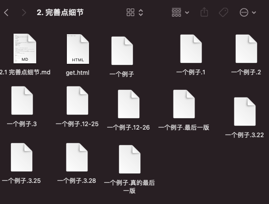

# 完善点细节

**无敌是多么，多么寂寞**

想象一下，加个前端，咱们的网站，就能够上传视频，然后让别人看电影了。往日的女神，都变成了你的小迷妹。花痴脸。

好了，那么咱们完善的目标就有了。

让女神变成小迷妹！

he tui。是要有个前端！


## 分析：抓个女神做前端

没有女神，那就自己写吧。

别看我，我也不会。

咱们后台程序员，简单的html也是要懂的好吧。你最好自己写。实在写不出来，工具里我做了一个。

1. 写个html，并配置文件位置，把它嵌入项目。
2. 完善接口，增加分页器，注意边界问题。
3. 解决跨域。
4. 关闭debug，使用线上模式。
5. 合并静态文件。
6. 使用pipenv。
7. 使用git，创建一个自己的远程项目。


## 工具

html文件：[download](pass)。自己把接口位置，换成你自己的地址。其它不一样的地方，自己修改。

django 官方文档。

[django 分页器](https://docs.djangoproject.com/zh-hans/3.1/topics/pagination/)。

[百度一下跨域](https://www.baidu.com/s?wd=django+跨域)， 找到[类似这种网站](https://www.cnblogs.com/ruhai/p/11270442.html)。

学会静态文件配置，这个百度，官网学都行。我建议最好多用官网。

[pipenv教程](https://www.cnblogs.com/blueberry-mint/p/13362737.html)， 自己百度学也可以。

git基本使用。[这个网站](https://www.runoob.com/manual/git-guide/)就挺好。比我以前学时候简单多了。分支什么的，早晚会明白，先会推送了再说。

> git 是什么，我有必要简单讲解一下。
>
> 我们在写一个文件时候，无论是不是程序，经常会遇到一个情况，就像这样。
>
> 
>
> so，我们伟大的前辈，发明了一个概念，版本管理。我们只需要一个文件，每次修改，都会打下一个tag，还可以自己写它，为了以后好找。并且两个tag之间，可以对比差别，进行切换。
>
> 把文件在横向的一直增加上，加了纵向的时间概念。这就是git的核心。

Pipenv

```
pipenv install
pipenv shell
pipenv run
pipenv install <pkg name> --skip-lock
```

django

```
python manage.py collectstatic
```

git

```
git init
git clone
git add .
git commit -m ""
git pull
git push
```


## 作者思路

1. 接口有了，但是数据量稍微大一点，比如十万条视频。不能一次给用户吧？那我就分页，一次给一页，一页给5个，完美。
2. 然后我打开官网，搜索分页。copy一下。
3. 分页器有了，做个前端页面，展示一下看看吧。考虑到这是一个教学项目，放弃vue和react，用最基本的代码！
4. one year later.  非常轻松的一年过去了。
5. 直接运行前端程序，纳尼？什么都没有出现，f12查看network记录，发现报错origin。百度一下。发现是跨域问题。然后再百度django解决跨域，一个包，几行代码，复制进去，搞定。
6. 修改settings文件，把模版文件，静态文件路径设置好，然后小心翼翼放好html文件。
7. views写一个能显示的视图，这中间查了一下django response，看看用哪个合适。写一个urls路径给它。ok，看上去没啥问题了。
8. 这会我又在想，后台是不是有点简陋？加上时间段段筛选，再加个电影标签的过滤吧。简单加了两行代码在admin里。
9. git推一下。


## 示例代码

admin

```
date_hierarchy = "up_time"  # 时间筛选
list_filter = ["label", ]  # 过滤器
```

views

```
def index(request):
    return render(request, "html/get.html")
```

安装跨域包

```
pip install django-cors-headers
```

settings

```
- 跨域
  INSTALLED_APPS ==> "corsheaders"
  MIDDLEWARE ==> "corsheaders.middleware.CorsMiddleware"

  # 增加下边所有
  CORS_ORIGIN_ALLOW_ALL = True  # 跨域的设置，全部允许
  CORS_ALLOW_CREDENTIALS = True  # 指明在跨域访问中，后端是否支持对cookie的操作
  # 允许的请求方式
  CORS_ALLOW_METHODS = (
   'DELETE',
   'GET',
   'OPTIONS',
   'PATCH',
   'POST',
   'PUT',
   'VIEW',
  )
  # 允许的请求头
  CORS_ALLOW_HEADERS = (
   'XMLHttpRequest',
   'X_FILENAME',
   'accept-encoding',
   'authorization',
   'content-type',
   'dnt',
   'origin',
   'user-agent',
   'x-csrftoken',
   'x-requested-with',
   'Pragma',
  )

- 模版文件设置
	TEMPLATES ==> DIRS ==> os.path.join(BASE_DIR, 'templates').replace('\\', '/')
	
- 静态文件设置
	STATIC_URL = '/static/'
  MEDIA_URL = '/upload/'
  MEDIA_ROOT = os.path.join(BASE_DIR, 'upload/').replace("//", "/")
  STATIC_ROOT = os.path.join(BASE_DIR, 'static/')

```


#### [完整项目地址](https://gitee.com/glittering/z_movie/tree/day2/)

**有问题，一定联系作者。**