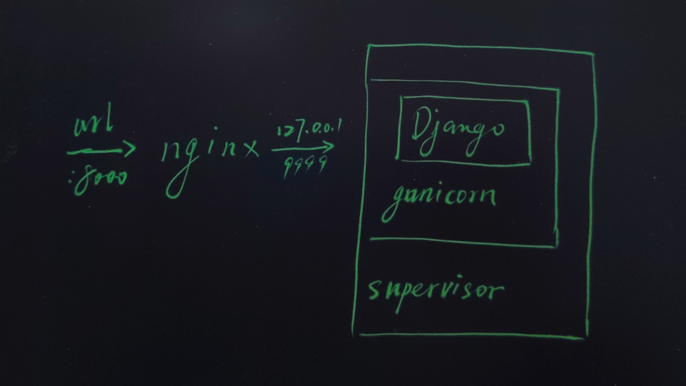
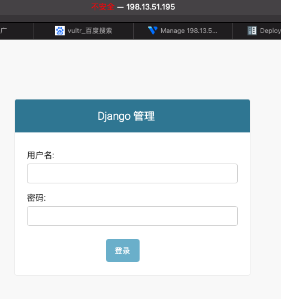
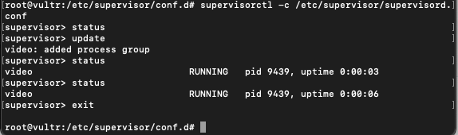

# 搞台服务器

项目跑起来了，如何让其他人也能够访问呢。部署服务器。

不要被部署两个字吓到。其实很容易的。

这里你可以直接看下边的内容，没有必要完全自己抠。

这些东西，不要记，不要记，不要记。

我们是一个速成课程，不是让你来背书的。有这篇文章就够了，只要做了一次，下次再有需要，对照来做就好了。


## 分析

1. 买台ubuntu服务器，最便宜的就行了。舍不得孩子套不住狼，能线上访问，和自己电脑上玩，完全两种感觉。实在舍不得孩子，就搭建个虚拟机吧。
2. 安装python3，pip， pipenv，gunicorn，supervisor，nginx。
3. 用pipenv下gunicorn把项目跑起来。
4. 把命令写到supervisor的配置文件里，用supervisor来守护。
5. nignx转发访问。


## 工具

相信大部分小伙伴，看到这里都是懵逼的。一脸我是谁，我在做什么的表情。不要怕，我来告诉你，这一堆专业的东西都是什么。下面开始无聊的讲课环节，你准备好枕头了吗？

1. 服务器，这是一个崭新世界的大门，我来帮你打开它。

   我们从小接触的都是window系统，从xp，win7，一直到现在的10。可是，你们有没有发现路由器，电视，手机上的安卓等，都不是win，它们是什么呢？linux。服务器上，也大多都是这个系统。win更偏向娱乐，linux更稳定，更安全。

   它有很多的展示方式，就像“妇联“的变色人一样，不管看上去是谁，实质上都是她。ubuntu就是其中一个皮肤样子。更广阔的世界，你们自己去探索。系统就讲到这里。

2. 软件

   linux是个系统，它也需要运行软件，其它的那一堆都是。那么，我们为什么要这么多软件呢？

   python，pip，不用说了。pipenv是为了让python项目更容易迁移。你把写好的代码，复制到新的电脑上，不用一个一个手动安装包了。

   然后，我们用runserver跑项目，发现没有，它只有一个端口，只能跑一个线程，只能以http方式来运行，而且出了bug，代码更改，都会项目重启/崩溃。显然这不是我们想要的效果。保证稳定，非常重要。

   然后，我们用了gunicorn，在一个端口上，跑多个线程，效率更高。

   把gunicorn跑在supervisor守护进程里边。顾名思义，super是一个守护。如果gunicorn，django，任何问题崩溃了，不能使用了。它能够第一时间，把问题记录下来，重启项目，保证项目的稳定运行。甚至说，你把代码删除了，一样能访问到，就是这么强大。

   最后我们不想让别人看到真实端口，也需要让人能以http方式，访问到wsgi内容。所以使用了nginx。还有就是，一台电脑上跑很多个项目，不同域名访问80端口，是不同的返回，这也是nginx的功劳。这是后话，你知道就好了。

   

- 服务器网站。一定要点击这个链接，你懂的。系统选择ubuntu。

  > 阿里云：https://www.aliyun.com/1111/new?userCode=fkqf3ofg，**有学生活动，新人活动，非常便宜。**
  >
  > Cloud: https://passport.ucloud.cn/?invitation_code=C1x8B6401EBBB35&ytag=rez7xS， **新生代强势网站，新人价格非常低，更有国外服务器。这个能玩的就多了，感兴趣call我。**
  >
  > Vultu: https://www.vultr.com/?ref=8759317-6G， **注册赠送100美元，服务器是计时的，按使用时长付费，练手神器。**
  >
  > 
  >
  > 剩下的云服务商，不建议使用！你钱多没地花，捐给我就好了。

- 自己搭建ubuntu

  > 用linux的，我就不说啥了，自己玩泥巴去。
  >
  > 
  >
  > 用win的小伙伴。
  >
  > 虚拟机软件，[vmware](https://www.cr173.com/soft/68480.html)。
  >
  > [ubuntu官网下载](https://ubuntu.com/#download)。建议下载server版本，这个是真实的服务器感觉。 实在害怕，下载desktop桌面版本的，也ok。

- [apt](https://www.cnblogs.com/hk-faith/p/8776471.html)

  ubuntu安装软件的命令。这个系统，不用自己去网上下载安装包。联网状态下，知道名字就能自动安装。

  ```shell
  apt update
  apt search
  apt install
  ```

- gunicorn

  > gunicorn 运行django。[点击查看](https://docs.djangoproject.com/zh-hans/3.1/howto/deployment/wsgi/gunicorn/)。
  >
  > 要查看gunicorn更多选项，比如同时跑4个线程等等，在系统里输入gunicorn -h，就能看到所有用法。事实上，所有的linux命令，都可以用-h来学会。

- [supervisor](https://www.jianshu.com/p/0b9054b33db3)

  > ##### supervisor配置文件：`/etc/supervisord.conf`
  >
  > ##### 子进程配置文件路径：`/etc/supervisord.d/`
  >
  > supervisord -c /etc/supervisord.conf
  >
  > 
  >
  > supervisorctl -c /etc/supervisord.conf
  >
  > 在ctl命令下：
  >
  > > help
  > >
  > > status
  > >
  > > Restart 
  > >
  > > start
  > >
  > > Stop

- [nginx](https://www.jianshu.com/p/a145a1bc60df)

  > [nignx 转发gunicorn](https://docs.gunicorn.org/en/latest/deploy.html)
  >
  > **配置文件**:/etc/nginx/conf.d/*.conf
  >
  > ```shell
  > systemctl start nginx.service
  > systemctl stop nginx.service
  > systemctl restart nginx.service
  > ```

- [Vim](https://www.runoob.com/linux/linux-vim.html)

  自己百度吧。这个能写东西，能保存就行了，高级功能先别碰。


## 作者思路



1. 在vultr上购买服务器。
2. 安装python3 python3-pip pipenv supervisor nginx。
3. 在根目录创建server，并把代码clone下来。
4. pipenv 环境下，runserver跑起来项目，确保项目可以正常运行。
5. 改为gunicorn跑起来项目。
6. 用supervisor把刚刚gunicorn跑项目，做成守护进程。
7. 在nginx里，把端口转接做好。


## 示例代码

不要害怕，虽然很长，但**都是复制粘贴**的事情。

1. 安装东西

```shell
apt update
apt install python3 python3-pip pipenv supervisor nginx
cd /
mkdir server
git clone https://gitee.com/glittering/z_movie.git
cd z_movie
git checkout day2
pipenv install
```

2. 跑项目起来

```shell
pipenv shell
python3 manage.py migrate
python3 manage.py createsuperuser
python3 manage.py runserver 0.0.0.0:8000
```

以我服务器的ip，成功跑了起来。~~完成了，下班~~！



3. 使用gunicorn跑一下看看。第一次我没有加-b，发现无法访问。使用gunicorn -h查看帮助，发现需要使用-b提供对外服务。

```
gunicorn z_movie.wsgi -b 0.0.0.0:8000
```

访问发现，丢失了样式，合并一下静态文件。

```
python3 manage.py collectstatic
```

卧槽？？！依然没有样式，你们知道原因吗。~~拍桌子，不干了！~~原来django搭建的是数据上的处理，而文件访问是服务器做的事情，这里指的是nginx。反正gunicorn已经能够运行了。那我们假装看不到问题，愉快进行下一步。一定要坚信，bug总是会莫名其妙消失的！

4. supervisor。

```shell
exit  # 退出pipenv shell的状态
vim /etc/supervisor/conf.d/video.conf
```

进入vim编辑器

> 按i进入编辑模式，
>
> 复制这段代码进去。
>
> 
>
> [program:video]
>
> command=pipenv run gunicorn z_movie.wsgi -b 127.0.0.1:9999
>
> directory=/server/z_movie
>
> startsecs=0
>
> stopwaitsecs=0
>
> autostart=true
>
> autorestart=true
>
> stopasgroup=true
>
> killasgroup=true
>
> 
>
> 按esc退出编辑模式，进入命令模式，输入:wq（依次按），回车

supervisorctl，更新并查看状态，已经跑起来了。喝口水，缓解一下心中的惆怅。

```
supervisorctl -c /etc/supervisor/supervisord.conf
status
update
status
exit
```



5. nginx。

```
vim /etc/nginx/conf.d/video.conf
```

进入vim

> i 进入编辑模式，粘贴下边内容进去。
>
> 
>
> server {
>
>   \# use 'listen 80 deferred;' for Linux
>
>   \# use 'listen 80 accept_filter=httpready;' for FreeBSD
>
>   listen 8000;
>
>   client_max_body_size 4G;
>
> 
>
>   \# set the correct host(s) for your site
>
>   server_name example.com www.example.com;
>
> 
>
>   keepalive_timeout 5;
>
> 
>
>   \# path for static files
>
>   location /static {
>
>    alias /server/z_movie/static;
>
>   }
>
> 
>
>   location / {
>
>    \# checks for static file, if not found proxy to app
>
>    try_files $uri @proxy_to_movie;
>
>   }
>
> 
>
>   location @proxy_to_movie {
>
>    proxy_set_header X-Forwarded-For $proxy_add_x_forwarded_for;
>
>    proxy_set_header X-Forwarded-Proto $scheme;
>
>    proxy_set_header Host $http_host;
>
>    \# we don't want nginx trying to do something clever with
>
>    \# redirects, we set the Host: header above already.
>
>    proxy_redirect off;
>
>    proxy_pass http://127.0.0.1:9999;
>
>   }
>
> 
>
>   error_page 500 502 503 504 /500.html;
>
>   location = /500.html {
>
>    root /path/to/app/current/public;
>
>   }
>
> }
>
> 
>
> Esc 进入命令模式， 输入:wq，回车保存。

6. 在shell里，重新加载nginx。

```
nginx -s reload
```

访问项目，居然完成了，这么突然？看，bug果然不见了吧。


对了，敲了半天代码，肯定懵了吧。还记得那张架构图吗，翻上去看看。你一定能豁然开朗。

全篇终。


**两个配置文件，我都放在了当前目录下，自行下载。**

这章有点难，对于新手来说，可能需要1-2天时间。先不要深钻，跑起来，再考虑每个功能。

我知道你头很大，大头娃娃一般比较聪明。你可以的。

有问题，及时联系作者。

